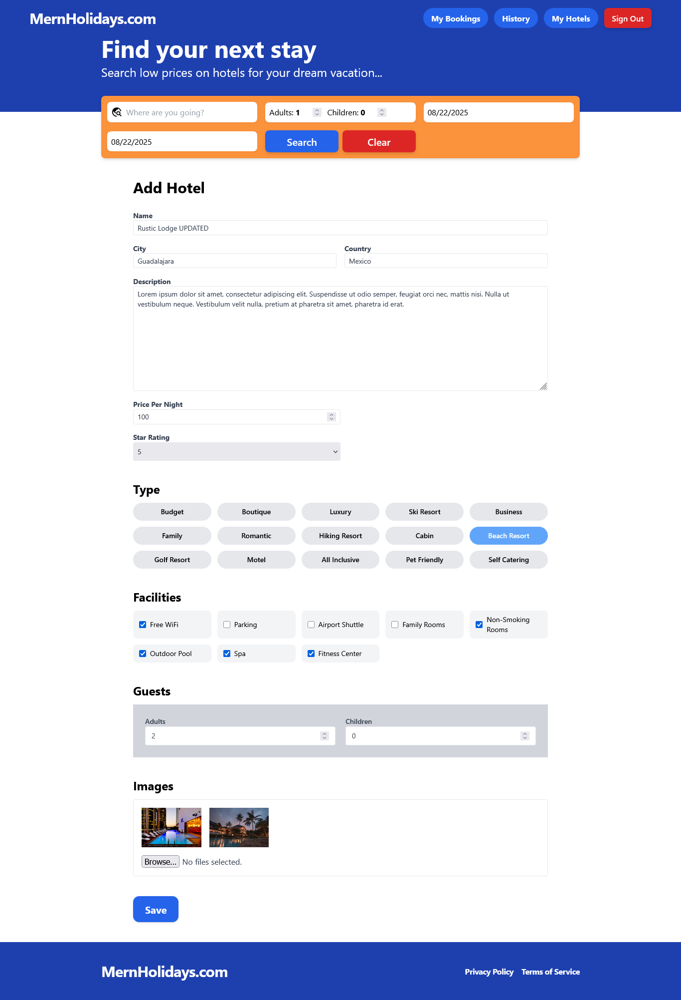
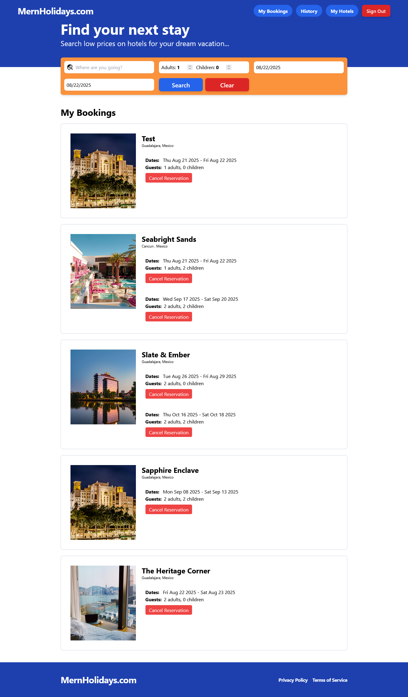
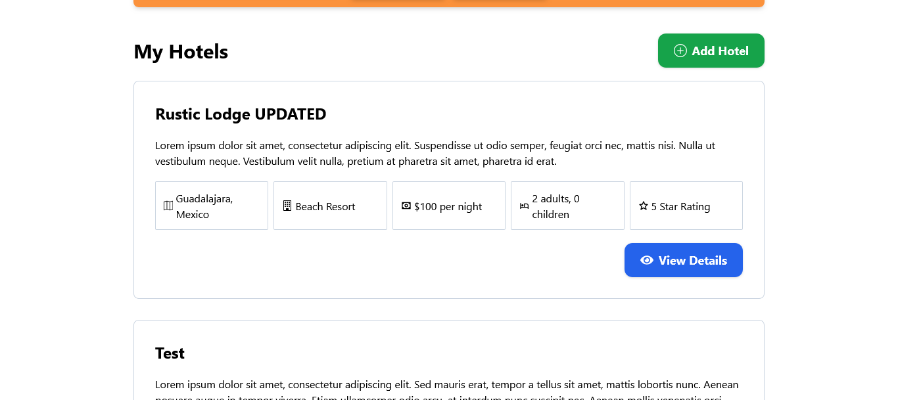

# Hotel Booking App 🏨

## Project Summary

The Hotel Booking App is a full-stack web application that allows users to search for hotels, create hotels, view hotel details, make secure bookings using Stripe, and manage their reservations through a dedicated dashboard. Users can also view their past bookings in a history page, and cancel upcoming reservations directly from the app.

The backend is powered by Express and MongoDB, while the frontend uses React with Vite for a fast development workflow. TailwindCSS provides modern, responsive styling, and Playwright is used for end-to-end testing. Both frontend and backend are easily run with `npm run dev`.

### Key Features

- **Hotel Search**: Search for hotels by city and filter results.

- **Hotel Details**: View hotel descriptions, images, and availability details.

- **Add Hotel**: Create your own hotels and add them to the platform.

- **Stripe Payments**: Make secure payments with integrated Stripe checkout.

- **Manage Bookings**: See all your active bookings in one place.

- **Cancel Reservations**: Cancel future bookings directly from your dashboard.

- **Booking History**: View past reservations on a dedicated history page.

- **Mobile Responsiveness**: Optimized layout for smartphones, tablets, and desktops.

- **Playwright Tests**: Automated end-to-end testing ensures smooth booking flows.

---

### Changelog Summary

This project is actively maintained. For a full history of updates, check the [CHANGELOG.md](./CHANGELOG.md).

Latest Updates:

- Added **History Page** for past bookings (Aug 2025).
- Added ability to **Cancel Reservations** (Aug 2025).
- Improved booking display and countdown to automatic removal of past bookings.

---

### Tech Stack

- **Frontend**: React (Vite), TailwindCSS, React Router
- **Backend**: Node.js, Express, MongoDB
- **Payments**: Stripe
- **Authentication**: JWT-based auth
- **Testing**: Playwright

---

### Environment Variables

Before running the app, create a `.env` file in both the **frontend** and **backend** folders with the following keys:

#### Frontend

VITE_API_BASE_URL=http://localhost:5000 # or your backend URL/port
VITE_STRIPE_PUB_KEY=your_stripe_publishable_key

#### Backend

MONGODB_CONNECTION_STRING=your_mongodb_connection_string
JWT_SECRET_KEY=your_jwt_secret
FRONTEND_URL=http://localhost:5173 # or your frontend URL/port

CLOUDINARY_CLOUD_NAME=your_cloudinary_cloud_name
CLOUDINARY_API_KEY=your_cloudinary_api_key
CLOUDINARY_API_SECRET=your_cloudinary_api_secret

STRIPE_API_KEY=your_stripe_secret_key

### Link

- Live Site: [MernHolidays](https://mern-booking-app-iaa4.onrender.com/)

---

### Screenshots

---

# Getting Started with Vite

This project was bootstrapped with [Vite](https://vitejs.dev/).

## Available Scripts

In the project directory, you can run:

### `npm run dev`

Runs the app in the development mode.  
Frontend will be available at [http://localhost:5173](http://localhost:5173).  
Backend will be available at [http://localhost:5000](http://localhost:5000) (depending on your setup).

### `npm run build`

Builds the frontend for production into the `dist` folder.  
The build is minified and optimized for performance.

### `npm run test`

Launches the Playwright test runner for end-to-end testing.

---

## Learn More

- [React documentation](https://reactjs.org/)
- [Vite documentation](https://vitejs.dev/)
- [TailwindCSS documentation](https://tailwindcss.com/)
- [Stripe Testing Cards](https://docs.stripe.com/testing)
